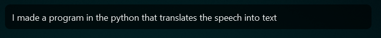
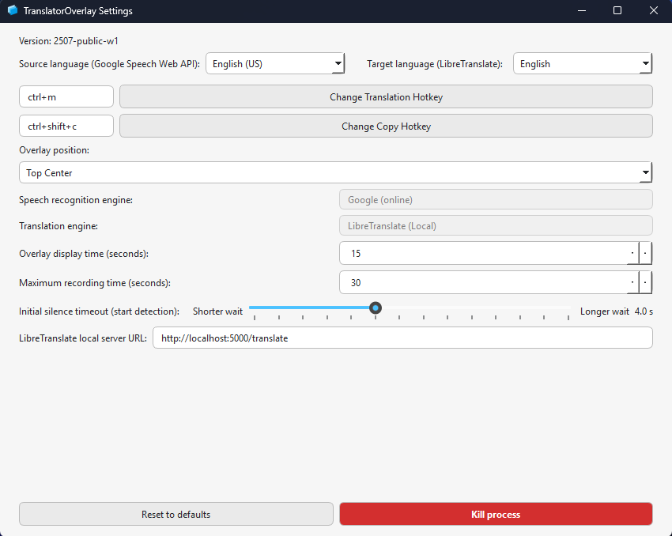

# OverlayTranslator

Python real-time speech-to-text translation overlay for Windows. Speak, see your translation instantly on screen, and stay focused, no switching windows, no distractions.

---

## 🚀 Quick Start

**No Python or libraries needed if you use the `.exe`!**

1. **Download the latest `.exe` from [Releases](https://github.com/synkolezankitwojejstarej/OverlayTranslator/releases).**
2. **Install [Docker Desktop](https://www.docker.com/products/docker-desktop/).**
3. **Open Docker and run CMD with this command:**
```powershell
docker run -d -p 5000:5000 -e LT_LOAD_ONLY="en,pl,de,fr,es,it,ru,nl,cs,pt" --name libretranslate libretranslate/libretranslate
```
- **Port number is flexible:** You do **not** have to use `5000:5000` you can use any available port, such as `5050:5050`.  
  Just remember to update the server URL in the app settings (e.g., `http://localhost:5050/translate`).
- **Tip:** You do NOT have to load all languages! Loading many languages can use several GB of RAM. 2 loaded languages ​​about 3.5GB RAM. 9 loaded languages ​​about 9-10GB RAM 
  If you only need specific languages (e.g. Polish and English), set `LT_LOAD_ONLY="pl,en"` to save memory.
- **Note:**  
  - All possible **Source Language** options (for speech recognition) are already included in the app by default.
  - **However, you must specify the translation languages you want LibreTranslate to load using the `LT_LOAD_ONLY` variable as shown above.**
    Below is the list of supported languages:

---

**Supported Target Languages (LibreTranslate):**
- `en` – English
- `pl` – Polish
- `de` – German
- `fr` – French
- `es` – Spanish
- `it` – Italian
- `ru` – Russian
- `nl` – Dutch
- `cs` – Czech
- `pt` – Portuguese

**Supported Source Languages (Speech Recognition):**
- `pl-PL` – Polish
- `en-US` – English (US)
- `de-DE` – German
- `fr-FR` – French
- `es-ES` – Spanish
- `it-IT` – Italian
- `ru-RU` – Russian
- `nl-NL` – Dutch
- `cs-CZ` – Czech
- `pt-PT` – Portuguese

---

## ✨ Features

- **Speech-to-text** (Google Speech Web API)
- **Local translation** (LibreTranslate via Docker, accurate & fast)
- **Customizable overlay** (position)
- **Hotkeys** for instant translation and copy-to-clipboard
- **System tray integration**
- **Persistent settings** (`settings.json`)

---

## 🖼️ Screenshots

<p align="center">
  
</p>

<p align="center">
  
</p>

---

## ⚙️ Requirements

- Windows 10/11 (tested on Windows 11)
- Minimum 16 GB RAM. Recommended 32 GB RAM
- Microphone
- Internet (for speech recognition)
- Docker Desktop (for LibreTranslate)
- **No Python needed for `.exe` users**

---

## 🛠️ Usage

- **Start Docker & LibreTranslate.**
- When you launch the app the settings window will appear automatically by default.
- Configure everything in the settings window: hotkeys, overlay, languages, server URL.
- Press your translation hotkey, speak, and see the overlay with your translation.
- Use the copy hotkey to quickly grab the last translation.

---

## 📝 Configuration

- All settings are saved in `settings.json`:
    - Windows: `%APPDATA%\TranslatorOverlay\settings.json`
- Defaults are restored if the file is missing or corrupted.

---

## 🛠️ Troubleshooting

- **LibreTranslate error?**  
  Make sure Docker is running and the container is started. Check the server URL.
- **Hotkey issues?**  
  Try a different combination. Avoid conflicts with other apps.
- **Speech recognition not working?**  
  Check your mic, system audio, and internet connection.
- **High CPU usage when enabling docker with Libretranslate ?**  
  Normal at startup, Libretranslate are loading.
- **Why does the "VmmemWSL" process take up so much RAM ?**
  "VmmemWSL" manages the WSL2 environment used by Docker. When running containers like LibreTranslate it allocates RAM for linux processes, memory usage drops only after stopping Docker.
- **Why does the overlay not appear on top of other windows?**
  Check overlay settings and make sure no other app is blocking it.
- **How do I update LibreTranslate to the latest version?**
  Stop and remove the old container, then run the Docker command again to pull the latest image.
  
---

## 📄 License

This project is licensed under the MIT License click [LICENSE](LICENSE) to view the full license text.
